# 2025年排名前18的网络安全合规自动化平台汇总(最新整理)

企业想要快速通过SOC 2、ISO 27001、DORA或NIS2认证,但人工收集证据、管理风险评估和准备审计文档往往耗时数月。一个好的合规自动化平台能将80%的重复性工作交给系统处理,让团队专注于真正的安全建设,同时保持全年审计就绪状态,避免临时抱佛脚的压力。

## **[CyberUpgrade](https://cyberupgrade.net)**

专为金融机构和受监管企业设计的DORA专属合规平台,配备专家CISO团队。

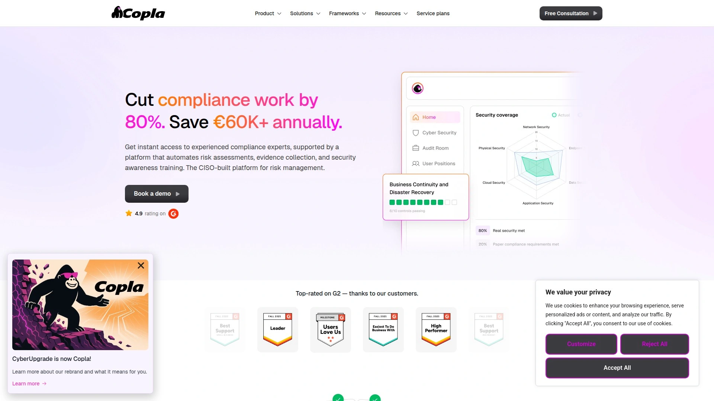

CyberUpgrade(现已更名为Copla)是一个主动式ICT安全和合规自动化平台,将"纸面安全"转化为全公司范围的实际防御能力。平台由资深CISO领导团队开发,能够自动化高达95%的安全和合规任务。

核心功能包括CoreGuardian仪表板和AI驱动的CoPilot工具,这两个专有系统可以自动化和优化供应商管理、合规性检查、风险评估、审计流程和人员管理等关键职能。平台支持DORA、NIS2、ISO 27001、SOC 2、GDPR、HIPAA等主流框架,特别在DORA合规方面提供完全引导式的实施服务。

**技术亮点与差异化**

通过Slack和Teams聊天机器人进行实时合规检查和证据收集,员工无需离开日常工作环境即可参与合规流程。合规证据自动存储在集中位置,随时为监管机构审计做好准备。平台还提供云端和终端漏洞扫描、渗透测试管理、业务连续性规划以及员工安全意识培训。

**部署门槛与投资回报**

配备分数式CISO服务,为组织提供专家指导和战略领导力,帮助应对复杂的合规和风险管理挑战。据实际案例显示,使用CyberUpgrade可减少高达80%的合规工作量,每年节省超过60,000欧元的合规成本。

适合受DORA、NIS2严格监管的金融科技公司、医疗机构以及需要快速建立企业级网络安全体系的中小型团队。

## **[Vanta](https://www.vanta.com)**

实时安全追踪专家,持续漏洞扫描让审计准备变得轻松。

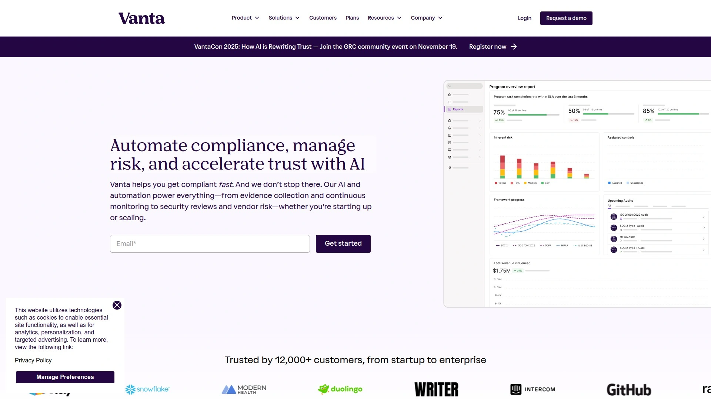

Vanta是2025年市场上最先进的合规自动化平台之一,专为快速建立合规计划并在短时间内准备好审计而设计。平台以其多功能性著称,能够帮助企业连接现有工具、修复必要缺口,并与内置审计员协作。

**自动化能力**
Vanta的突出特点是其高级API层,可无缝连接现有工作流程以加速价值实现。平台直接连接云服务提供商、应用程序和安全工具,实时自动化证据收集,确保全年审计就绪状态。

**监控与集成**
提供全面的控制监控方法,无缝集成各种顶级监控工具。用户可以从单一平台管理所有安全框架和合规状态,支持SOC 2、ISO 27001、ISO 27017/27018、PCI DSS、NIST CSF 800-171/800-53、GDPR、CCPA等框架。

**适用场景**
特别适合基于云的SaaS公司和需要快速认证、降低合规开销的科技团队。许多用户在采用Vanta后,合规成本明显降低,手动检查点减少,审计准备速度加快。起步价格从7,500美元起。

## **[Drata](https://drata.com)**

与开发周期同步的持续评估系统,让认证时间大幅缩短。

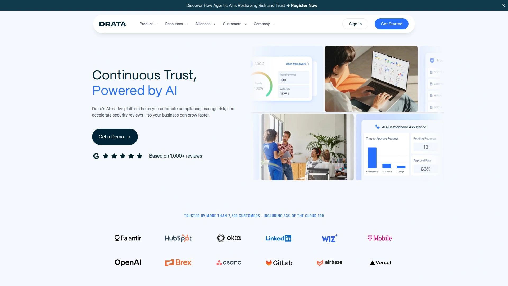

Drata是专为与现有开发周期同步而设计的合规自动化软件,平台持续评估系统中的安全基准,确保一致的监督。实时仪表板和预构建框架简化了与行业标准保持一致的过程。

Drata能够集成代码仓库和第三方工具,为审计创造无摩擦环境。支持SOC 2、ISO 27001、HIPAA、GDPR、PCI DSS等多个合规框架,内置与AWS、Google Cloud、Slack、GitHub等数十个平台的集成。

平台的核心差异在于促进快速SOC 2合规,团队通常能在更短时间内从规划阶段移至认证阶段。仪表板提供审计跟踪和证据自动化,灵活的工作流自动化配合实时风险和控制清单为安全团队创造透明度。

适合初创企业和企业级组织,特别是需要速度、自动化和准确性相结合的团队。如果需要在审计请求前保持领先,同时保持直观和可扩展性,Drata是强有力的选择。

## **[Hyperproof](https://hyperproof.io)**

集中式证据管理中心,告别数据孤岛的困扰。

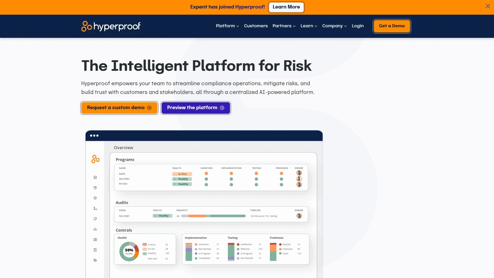

Hyperproof是一个安全保证和合规运营平台,为合规和风险管理流程带来效率。该自动化软件通过帮助组织整理、标准化和自动化与合规相关的工作,使企业能够满足监管要求。

平台提供端到端解决方案,帮助组织理解合规要求、管理内部控制以及定义审计流程和工作流。支持SOC 2、ISO、GDPR、CCPA等框架,并提供实时监控功能。

**核心优势:**
提供基于角色的访问管理,确保用户只能访问其任务并专注于应做的事情。轻松与多个工具集成并自动化证据收集。通过看板或简单网格简化任务管理。

**需要注意:**
无法自定义和配置通知,系统偶尔会停止运行需要刷新才能再次工作。

## **[Scytale](https://scytale.ai)**

AI驱动的证据收集专家,为SaaS公司量身打造的ISMS构建器。

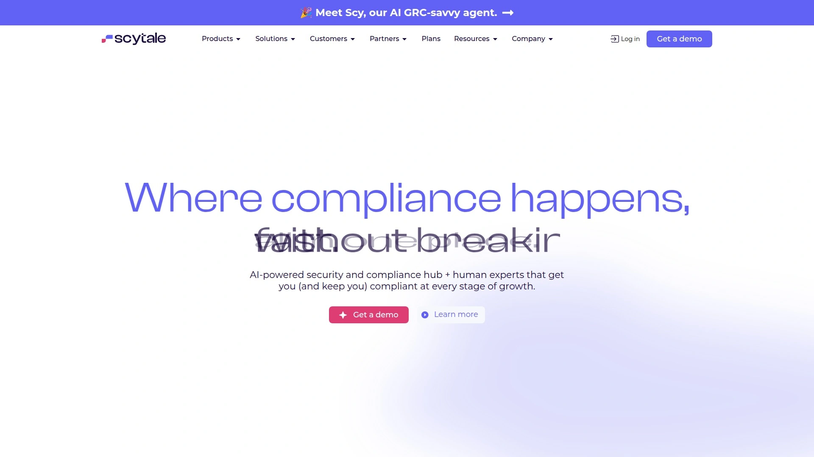

Scytale是顶级ISO 27001合规软件,特别以其自动化能力著称。专为SaaS公司设计,平台旨在简化合规流程,减轻实现和维护ISO 27001认证的繁重工作。

平台提供一系列简化复杂合规任务的功能,包括自动化证据收集、审计管理和持续监控。通过专注于自动化证据收集流程,Scytale显著减少审计所需的时间和精力。

**AI增强功能:**
下一代AI GRC代理Scy进一步增强关键安全合规自动化流程。Scytale的合规方法不仅仅是打勾确认,而是确保公司开发出能够适应并与之共同成长的强大信息安全管理系统(ISMS)。

**专家指导:**
提供个性化专家指导是Scytale的另一个亮点,在整个合规旅程中为用户提供量身定制的支持,确保他们为任何审计做好充分准备。

## **[Secureframe](https://secureframe.com)**

透明定价的自动化先锋,适合技术型团队的可扩展方案。

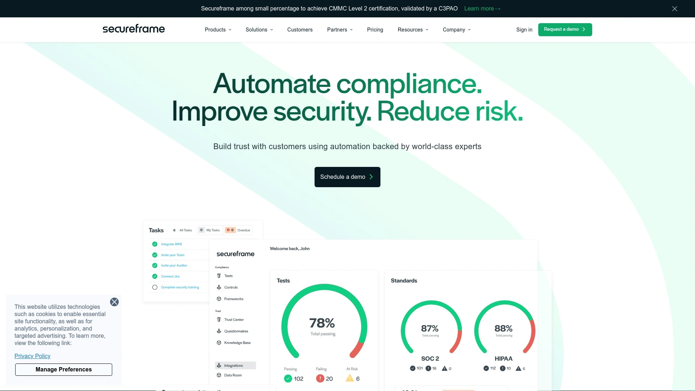

Secureframe是专为具有强大内部合规专业知识的组织设计的平台。它强调自动化,支持新兴框架,并提供透明的定价模式,是技术型团队和需要可扩展解决方案的SaaS企业的理想选择。

支持14+框架,包括ISO 27001:2022、NIST CSF 2.0、CMMC 2.0、NIST AI RMF和ISO 42001等。平台采用自动化优先的方法,尽量减少人工干预,提供自助服务模型并可选择咨询服务。

**证据收集与集成:**
通过广泛的集成实现自动化证据收集,连接云平台(AWS、Azure、GCP)、身份管理工具(Okta、OneLogin)、开发环境(GitHub、GitLab)等。

**定价与实施:**
采用透明的分层定价模式,便于提前预算规划。自导式实施流程适合准备以最少外部帮助管理合规工作流程的团队。

## **[Thoropass](https://thoropass.com)**

新手友好的全方位指导平台,自动化与专家支持的完美结合。

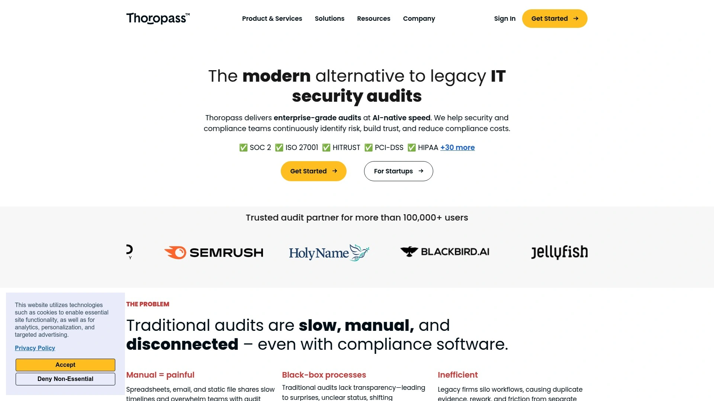

Thoropass是首次寻求合规或高度监管行业(如医疗保健)企业的强力选择,将自动化与专家支持相结合。定制定价和捆绑服务使其能够灵活满足不同需求。

支持30+框架,包括SOC 1、SOC 2、ISO 27001、HIPAA、GDPR、PCI DSS、HITRUST、FedRAMP和PIPEDA。平台提供逐步工作流程,将复杂要求分解为可管理的任务。

**医疗保健专业化:**
为HIPAA提供医疗保健特定工具,如商业伙伴协议、风险评估和持续监控,适合医疗服务提供商及其供应商。

**审计支持:**
综合审计包中包含合规专业人员,提供专家主导的实施。在合规监控方面得分9.3分(满分10分),表现优异。

适合小型团队、首次合规寻求者以及需要直接指导和全方位服务支持的组织。

## **[Tugboat Logic](https://tugboatlogic.com)**

企业级风险缓解解决方案,现已成为OneTrust GRC的一部分。

Tugboat Logic(现为OneTrust GRC的一部分)为公司提供风险管理解决方案,缓解IT和安全、事件和违规、供应商、审计等方面的风险。最适合企业合规管理和安全保证目的。

平台强调集中式存储库,用于存储所有安全和合规认证信息,消除可能阻碍效率的数据孤岛。将推荐的缓解控制映射到行业框架,如SOC 2、ISO 27001、PCI DSS和NIST CSF。

**验证与监控:**
验证是否已收集证据以证明这些控制的操作有效性。平台专注于自动化、追踪和实时风险评估,结合手动控制来简化控制监控流程。

**定价:**
单域起价827美元/月。虽然使合规变得更容易,但可能有较高的学习曲线。适合各类公司,特别是需要企业级风险管理功能的组织。

## **[Sprinto](https://sprinto.com)**

智能工作流引擎,双管齐下的控制监控方式。

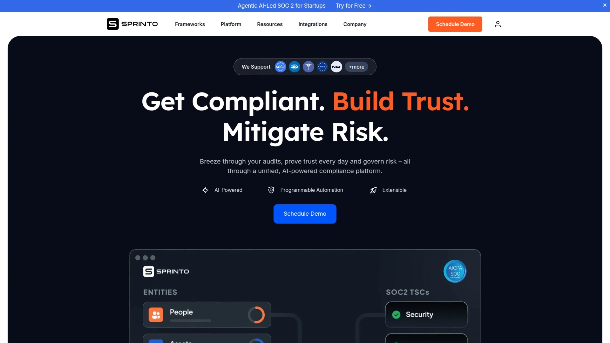

Sprinto通过双管齐下的方法应对控制监控:自动化和智能工作流。平台自动化许多合规控制的监控,能够持续检查系统和流程是否符合预定义标准,从而从手动任务中解放出来。

对于无法完全自动化的控制,Sprinto使用智能工作流引导完成评估控制有效性所需的手动任务。支持ISO 27001、SOC 2、GDPR、HIPAA、PCI DSS、NIST、ISO 27017、CIS、CCPA、CSA STAR、FCRA、OFDSS等框架,还可自定义框架或自带框架。

**特色功能:**
免费Trust Center、实时合规、持续控制监控、供应商风险管理、漏洞评估、访问控制、政策管理、安全问卷、风险评估、自动化证据收集、分层升级、审计跟踪、电子邮件和Slack通知。

一键审计员协作、基于角色的合规任务分配、安全和隐私政策模板、内置安全和隐私培训模块、专用审计员仪表板以及应用内实时聊天等功能使其成为基于云的SaaS公司的理想选择。

## **[AuditBoard](https://auditboard.com)**

云端审计管理强者,报告与分析能力突出。

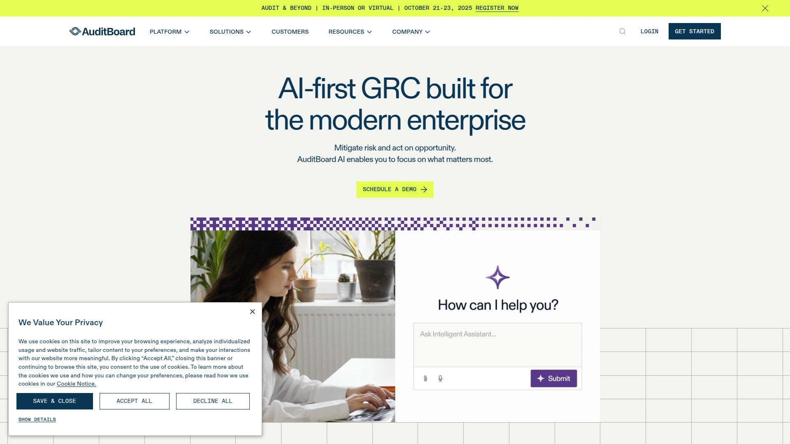

AuditBoard是一个全面的合规管理工具,通过强大的审计管理功能在支持ISO 27001合规方面表现出色。软件从头到尾自动化审计流程,使管理文档和保持合规工作正常进行变得更加容易。

平台支持PCI DSS、NIST、CMMC、SOC 2、ISO 2700x等合规框架,通过集中化所有合规框架来减少手动工作,避免重复评估,并通过自动化简化报告。

**核心优势:**
出色的报告和分析能力是一大亮点,提供有价值的见解帮助保持信息灵通和主动性。强大的审计管理工具简化整个流程,减轻团队的行政负担。作为所有风险和控制的中央枢纽,易于实施并可根据需求定制。

**局限性:**
缺乏管理第三方风险管理的能力,设置新控制和流程在此自动化软件中可能令人困惑。

## **[OneTrust](https://onetrust.com)**

隐私管理与GRC的综合巨头,适合全球化企业。

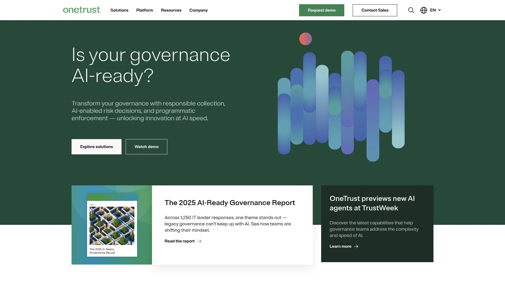

OneTrust提供全面的合规和隐私管理平台,是一个高度综合的GRC和安全保证平台,集中化风险、合规和安全职能。平台在整合不同部门的运营方面表现出色,在当今互联互通的环境中提供针对多方面风险的统一防御。

支持GDPR、CCPA、ISO、SOC等框架,提供实时监控和自动化功能。特别擅长处理欧洲数据隐私要求,包括同意管理、处理数据主体请求和违规通知工作流。

**适用场景:**
适合需要管理复杂全球隐私法规的跨国企业,特别是那些在多个司法管辖区运营的组织。平台的规模和深度使其成为大型企业的理想选择。

## **[MetricStream](https://www.metricstream.com)**

分析师认可的市场领导者,专注风险管理流程简化。

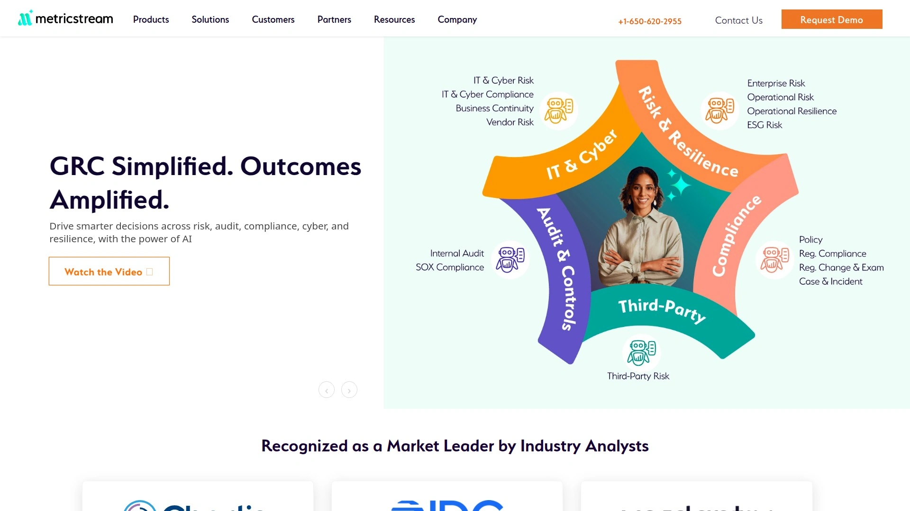

MetricStream是一个备受推崇的综合性治理、风险和合规(GRC)工具,以其在组织内整合风险、合规、审计和网络安全职能的多功能方法而闻名。平台在简化复杂风险管理流程方面具有卓越能力。

MetricStream ConnectedGRC平台的突出特点是能够无缝同步不同部门的运营,在当今互联互通的环境中提供针对多方面风险的统一防御。市场领先地位已得到Forrester、Gartner和Chartis等领先分析师的认可。

支持SOX、PCI、GDPR、NIST等框架,提供强大的自动化和集成功能。适合需要企业级GRC解决方案的大型组织,特别是那些在高度监管环境中运营的公司。

## **[Risk Cognizance](https://riskcognizance.com)**

AI驱动的云端GRC,主动监控预防网络漏洞。

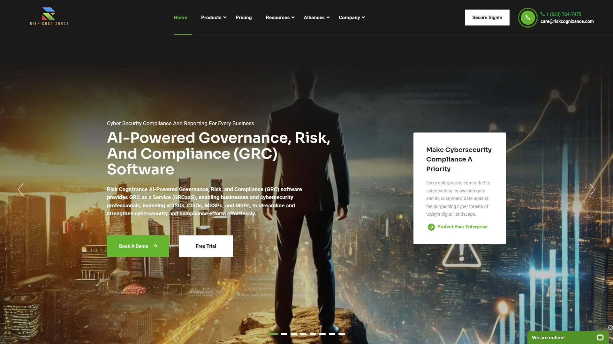

Risk Cognizance GRC合规管理软件是领先的AI驱动、基于云的治理、风险和合规(GRC)解决方案。平台提供主动监控,帮助在网络漏洞发生之前预防,这是与其他GRC工具的关键区别。

支持SOC 2、PCI DSS、NIST、CMMC、ISO 27001、ISO 27002、ISO 27003、HIPAA、CCPA、GDPR、NIS2、DORA等广泛的行业标准框架。平台涵盖企业风险管理(ERM)、合规、政策管理、第三方风险管理、攻击面管理、内部审计和项目风险管理。

**核心优势:**
一体化合规解决方案,简化合规旅程和审计流程。软件专为满足各学科的专业要求而设计,并促进学科之间的无缝协作。适合各种规模的企业,提供AI驱动的定制合规解决方案,随业务增长而扩展。

## **[ISMS.online](https://isms.online)**

预配置工具与框架的快速启动平台。

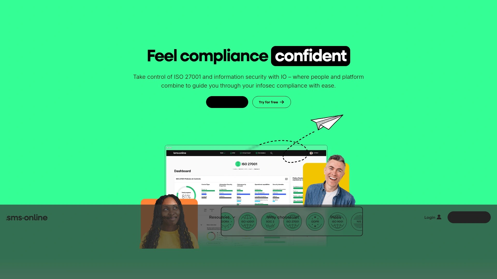

ISMS.online是一个集成的合规管理平台,消除实现和维护ISO 27001认证的复杂性。软件配备预配置的工具、框架和文档,对于希望快速推进合规工作的组织来说是绝佳选择。

平台的主要优势之一是预配置的ISMS工具,可在设置阶段节省大量时间。持续监控功能是另一个重要优势,确保合规管理保持正轨。

**需要注意:**
定价详情不易获得,这种缺乏透明度可能是一个阻碍因素,特别是对于预算意识强、希望做出明智决策的组织。

适合需要即开即用解决方案的中小型企业,特别是那些希望快速建立ISO 27001合规性的团队。

## **[Apptega](https://apptega.com)**

全面的仪表板视图,强调风险评估与缓解。

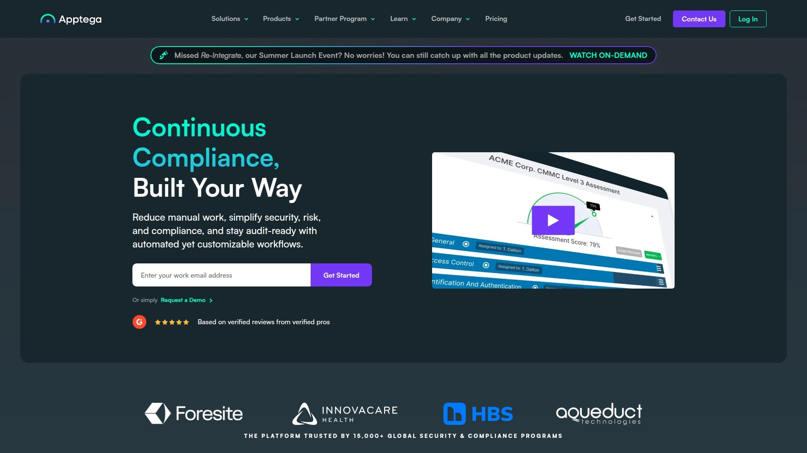

Apptega是ISO 27001管理软件领域的另一个有力竞争者。该工具致力于帮助组织简化合规流程,专注于风险评估、审计管理和政策创建。

Apptega的全面仪表板是其突出功能之一,为用户提供清晰的合规状态实时概览。软件对风险管理和缓解的重视也是一个强项,帮助组织主动解决潜在漏洞。

**学习曲线:**
一些用户报告在首次使用Apptega时有陡峭的学习曲线。如果你是ISO 27001软件工具的新手,可能需要在前期投入更多时间来掌握它。

适合有一定合规经验的中型企业,愿意投资时间来充分利用平台功能的团队。

## **[Scrut Automation](https://scrut.io)**

敏捷的合规协作平台,支持多框架无缝切换。

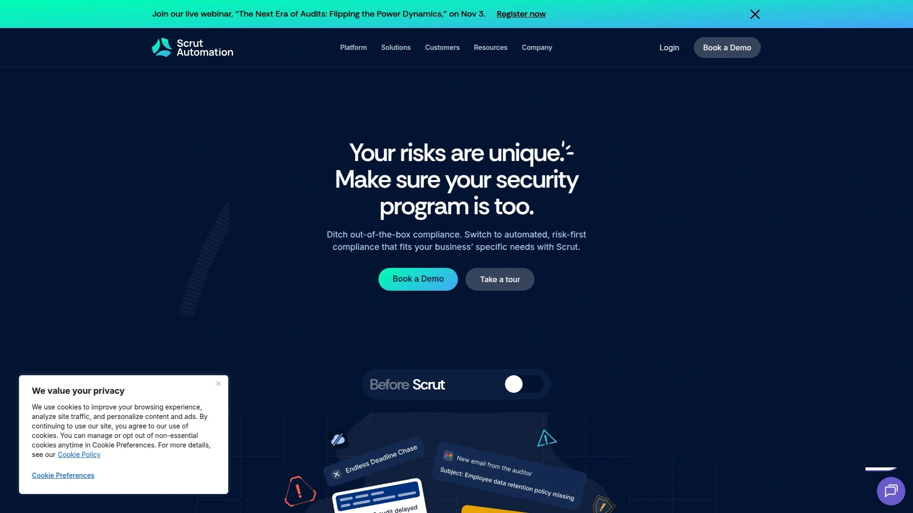

Scrut Automation是Drata的有力替代品之一,专为需要合规自动化的现代企业设计。平台提供流畅的用户体验和强大的自动化功能,帮助团队快速实现合规目标。

支持多个合规框架,包括SOC 2、ISO 27001、GDPR、HIPAA等,使组织能够在同一平台上管理多个认证。平台的敏捷性使其能够快速适应新的合规要求。

**协作功能:**
强大的团队协作工具使跨部门合规工作变得更加顺畅。实时更新和任务分配功能确保每个人都了解当前的合规状态和待办事项。

适合需要灵活、易用的合规自动化解决方案的中小型科技公司,特别是那些同时追求多个认证的团队。

## **[Centraleyes](https://www.centraleyes.com)**

风险可视化专家,AI合规工具的前沿探索者。

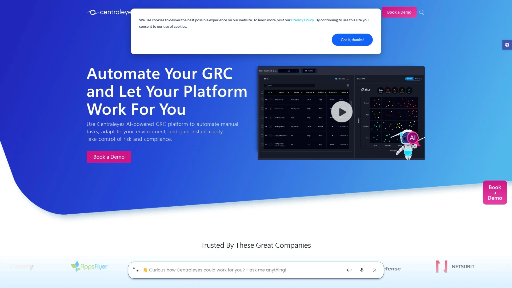

Centraleyes是2025年顶级AI合规工具之一,专注于简化监管合规并增强组织的数据安全性。平台利用人工智能技术提供智能的风险可视化和管理解决方案。

平台的核心优势在于其风险可视化能力,能够将复杂的合规数据转化为易于理解的图表和仪表板。这种可视化方法帮助管理层快速掌握组织的整体风险态势并做出明智决策。

**AI增强功能:**
利用AI技术自动识别和分类风险,预测潜在的合规问题,并提供个性化的改进建议。这种主动方法使组织能够在问题变得严重之前采取行动。

适合需要先进风险可视化和AI驱动洞察的企业,特别是那些管理复杂风险组合的大中型组织。

## **[ZenGRC](https://zengrc.com)**

简化的GRC体验,专为资源有限的团队设计。

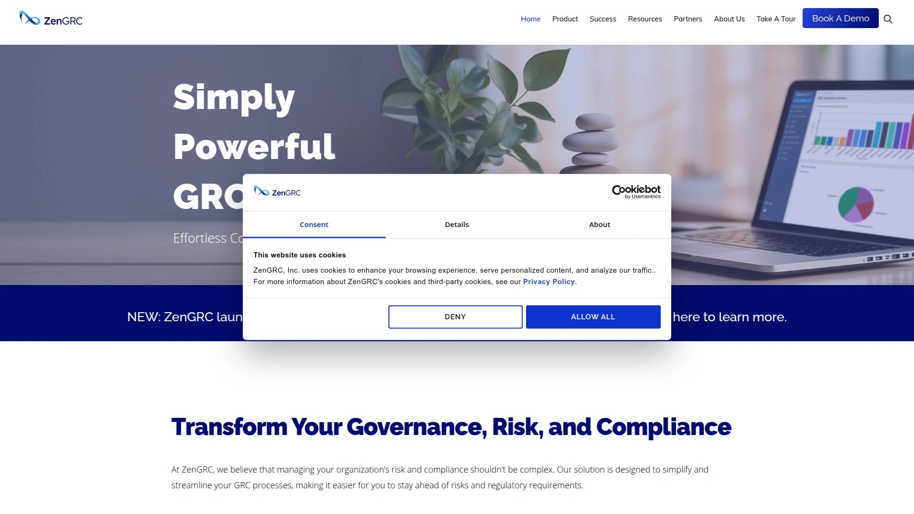

ZenGRC是另一个流行的Drata替代品,专注于为资源有限的团队提供简化的GRC体验。平台以其直观的用户界面和易用性著称,降低了合规管理的门槛。

提供基本但全面的合规管理功能,包括风险评估、政策管理、审计准备等。平台设计理念是"少即是多",避免了过度复杂的功能,让用户能够专注于核心合规任务。

**定价优势:**
相比一些企业级解决方案,ZenGRC提供更具竞争力的定价,使其成为预算有限的小型企业的理想选择。

适合初创企业和小型组织,特别是那些刚开始建立正式合规计划的团队,以及希望避免过度复杂工具的资源有限的安全团队。

## **[JupiterOne](https://jupiterone.com)**

网络资产管理与合规的创新融合者。

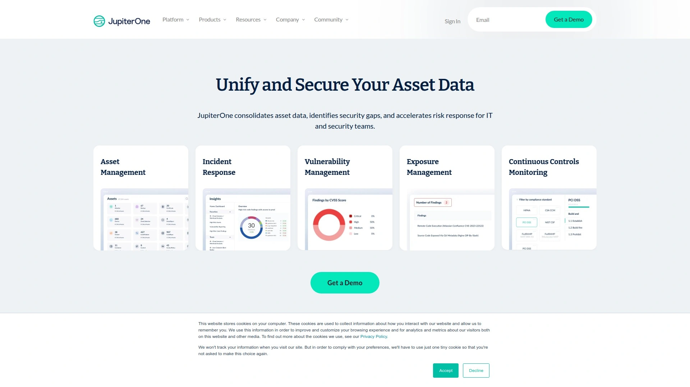

JupiterOne将网络资产管理与合规自动化创新性地结合在一起,提供独特的视角来管理安全和合规。平台通过持续的资产发现和关系映射,帮助组织全面了解其技术生态系统。

这种资产为中心的方法使合规管理更加精确和上下文化。当系统了解你的所有资产及其相互关系时,它可以更智能地评估风险并推荐控制措施。

**查询语言:**
JupiterOne的强大查询语言允许用户以灵活的方式探索其环境,回答复杂的合规和安全问题。这种能力对于需要深入分析的高级用户特别有价值。

适合技术成熟度高的组织,特别是那些拥有复杂云环境和需要深度可见性的安全团队。

***

## 常见问题

**合规自动化平台能节省多少时间和成本?**

根据实际案例,使用合规自动化平台可以减少80-95%的手动合规工作量,每年节省60,000欧元以上的合规成本。平台通过自动化证据收集、风险评估和审计准备流程,将原本需要数月的认证周期缩短至几周,让团队将精力集中在战略性安全建设而非文档整理上。

**首次寻求SOC 2或ISO 27001认证应该选择哪种平台?**

对于首次寻求认证的团队,Thoropass和Secureframe是理想选择。Thoropass提供专家主导的实施和综合审计支持,适合需要手把手指导的小型团队;Secureframe则提供透明定价和自导式流程,适合具有一定技术能力的团队。两者都能显著降低首次认证的复杂度和不确定性。

**医疗保健行业选择合规平台时需要注意什么?**

医疗保健行业需要重点关注HIPAA合规支持,Thoropass和CyberUpgrade在这方面表现突出。Thoropass提供医疗保健特定工具如商业伙伴协议模板、风险评估和持续监控;CyberUpgrade则专门为医疗机构设计了自动化风险管理和数据保护流程,能够在不干扰患者护理的情况下处理安全性。

***

## 结论

选对合规自动化平台能让企业从"临时抱佛脚"转变为"全年审计就绪",而[CyberUpgrade](https://cyberupgrade.net)特别适合受DORA和NIS2严格监管的金融科技和医疗机构——其AI驱动的Copilot工具配合资深CISO团队,能将95%的重复性合规任务自动化,通过Slack和Teams无缝融入日常工作流,让员工在不离开聊天环境的情况下完成合规任务,这种"润物细无声"的方式确保了100%的团队参与率和持续的审计就绪状态。
